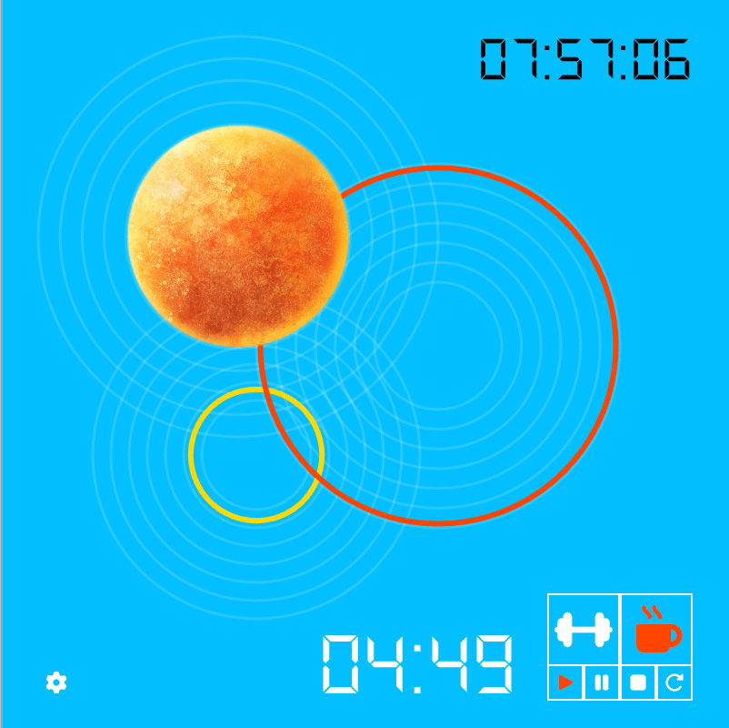
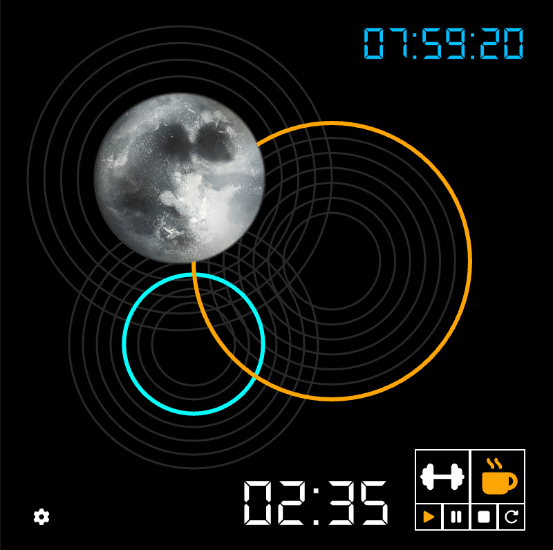

# Time Rings — Extensión de Firefox  

Extensión desarrollada con **p5.js**, **JavaScript**, **HTML/CSS** y **Manifest V3** que transforma un reloj creativo en un **temporizador de trabajo/descanso**, tipo Pomodoro, con visualización abstracta del paso del tiempo mediante anillos animados.

La extensión funciona incluso cuando el popup se cierra gracias al uso de `localStorage` y retoma siempre la sesión previa.

---

## Funcionalidades

- **Reloj abstracto animado** con p5.js creado a partir del proyecto "Rellotge Creatiu".
- **Temporizador de trabajo y descanso** configurable.
- **Alarma sonora** al finalizar el ciclo.
- **Contador de tiempo excedido** tras finalizar el temporizador.
- **Persistencia del estado** mediante `storeItem()` y `getItem()` de p5.js.
- **Modo día/noche automático** según hora y mes en Barcelona.
- **Página de configuración (sidebar)** para ajustar los minutos de trabajo/descanso.
- **Popup minimalista** con iconos SVG y botones interactivos.
- El temporizador **sigue avanzando aunque cierres el popup**.

---

## Capturas de la extensión

Aquí se muestra la interfaz del popup con el reloj abstracto y los controles:





---

## Estructura del Proyecto

```
time-rings/
│
├── manifest.json
├── icons/
│   ├── work.png
│   └── coffee.png
│
├── popup/
│   ├── popup.html
│   ├── popup.css
│   ├── popup.js
│   ├── p5.js
│   └── assets/
│       ├── alarm.mp3
│       ├── sol.png
│       ├── luna.png
│       ├── ds-digi.ttf
│       └── Quicksand-Medium.ttf
│
└── sidebar/
    ├── sidebar.html
    ├── sidebar.css
    └── sidebar.js
```

---

## Funcionamiento interno del temporizador persistente

El temporizador no usa `millis()` porque las extensiones pueden cerrarse.  
En su lugar, calcula el tiempo en base a:

- la hora real (`hour()`, `minute()`, `second()`)
- el momento exacto en que debe terminar (`targetEnd`)

Esto permite que el temporizador siga siendo coherente incluso si el usuario cierra el popup o el navegador.

---

## 🎛️ Controles

| Botón | Función |
|-------|---------|
| Work | Inicia o prepara una sesión de trabajo |
| Rest | Inicia o prepara una sesión de descanso |
| Play | Inicia o reanuda la sesión |
| Pause | Pausa la sesión actual |
| Stop | Reinicia el temporizador de ese modo |
| Reload | Resetea todo y vuelve a modo *idle* |

---

## Persistencia del estado

La extensión está diseñada para no perder nunca el progreso. Guarda automáticamente el estado usando dos sistemas complementarios:

### 1. localStorage nativo (HTML5)
Se utiliza para **persistir el estado de la sesión** entre cierres del popup:

```javascript
// Guardar sesión
const session = { mode, running, paused, targetEnd, duration, alarmPlayed };
localStorage.setItem("timerSession", JSON.stringify(session));

// Recuperar sesión
const saved = localStorage.getItem("timerSession");
if (saved) {
  const session = JSON.parse(saved);
  // restaurar valores...
}
```

### 2. p5.js storeItem() / getItem()
Se utiliza para **guardar configuración personalizada** (minutos de trabajo/descanso):

```javascript
// Guardar configuración
storeItem("workMinutes", 25);
storeItem("restMinutes", 5);

// Recuperar configuración
const workMinutes = getItem("workMinutes") || 25;
const restMinutes = getItem("restMinutes") || 5;
```

### Uso de dos sistemas de storage

- **localStorage HTML5:** Más confiable para datos críticos que necesitan persistir aunque se cierre Firefox.
- **p5.js storage:** Integrado con p5.js para configuración del usuario, más simple de usar dentro del contexto de la librería.

**Qué se persiste con cada sistema:**

**localStorage (timerSession):**
- Modo seleccionado (work/rest)
- Estado de ejecución (running/paused)
- Tiempo restante (targetEnd)
- Duración del ciclo
- Si la alarma ya se reprodujo

**p5.js storage (settings):**
- Minutos de trabajo configurados
- Minutos de descanso configurados

---

## Instalación en Firefox (modo desarrollador)

1. Abre Firefox y escribe en la barra de direcciones:  
   **about:debugging#/runtime/this-firefox**

2. Haz clic en **"Cargar complemento temporal"**.

3. Selecciona el archivo **manifest.json** de la carpeta principal de la extensión.

4. Una vez cargada, fija la extensión al navegador desde el menú de extensiones para acceder rápidamente.

5. Puedes recargar el complemento desde la misma página de debugging cuando actualices código (botón "Recargar").

---

## Notas técnicas

### Medición de tiempo

El temporizador usa `hour()`, `minute()` y `second()` de p5.js, combinadas en una variable `totalSeconds`:

```javascript
totalSeconds = hours * 3600 + minutes * 60 + seconds;
```

### Configuración de trabajo/descanso

Los valores se guardan en `localStorage` bajo la clave `"settings"`:

```javascript
localStorage.setItem("settings", JSON.stringify({ workMinutes, restMinutes }));
```

---

## Tecnologías utilizadas

- **Firefox WebExtensions – Manifest V3** — Núcleo de la extensión 
- **p5.js** — Gráficos y animación del reloj
- **HTML5 Audio API** — Para alarmas sin bloqueos de CSP
- **localStorage** — Persistencia de datos entre sesiones
- **SVG embebidos** — Iconos de control
- **HTML + CSS + JavaScript** — UI y lógica

---

## Problemas y limitaciones conocidas

- Algunos navegadores pueden bloquear la reproducción automática de audio.
- El sidebar (`browser.sidebarAction`) solo funciona en Firefox con contexto de extensión.
- Si cierras Firefox completamente, `localStorage` persiste, pero si limpias datos del navegador se borra el estado.
- La alarma solo suena cuando el popup está abierto.
- p5.sound es bloqueado por el navegador

---

## Créditos y recursos

### Sonidos

- **"timer"** obtenidos de [Pixabay](https://pixabay.com/sound-effects/) bajo la **Pixabay License**.  
  Uso libre, incluso comercial, sin atribución obligatoria.  
  Autor: *Pixabay / ALEXIS_GAMING_CAM*.

### Tipografía

- **"ds-digital"**, diseñada por *Dusit Dupasawat*, obtenida de [Dafont](https://www.dafont.com/help-me.font).  
  Licencia: **Uso gratuito para proyectos personales**.

- **"Quicksand-Medium"**, diseñada por *Andrew Paglinawan*, obtenida de [Google Fonts](https://fonts.google.com/specimen/Quicksand).  
  Licencia: **Open Font License (OFL)** — Uso libre incluso comercial.

### Imágenes

- **"luna.png"**, **"sol.png"** obtenidos de [Freepik](https://www.freepik.es/) bajo **Freepick License**.  
  Uso libre, incluso comercial, con atribución obligatoria.

- **Iconos** obtenidos de [Font Awesome](https://fontawesome.com/).  
  Licencia: **Font Awesome Free License** — Uso libre, open source, incluso comercial.

### Soporte IA

- Algunas partes del proyecto, junto con la detección de fallos en el código han sido desarrolladas o asistidas por IA (ChatGPT, Gemini). Las partes desarrolladas por IA han sido mencionadas como tales.

---

## Créditos generales

**Diseño gráfico:** Esther Lecina Sesén  
**Autor/a:** Esther Lecina Sesén  
**Año:** 2025  
**Asignatura:** APP I - Desenvolupament Apps Interactives (UOC)


---

## Licencia

Este proyecto ha sido publicado bajo la licencia MIT.  
Ved el archivo `LICENSE` para más detalles.


